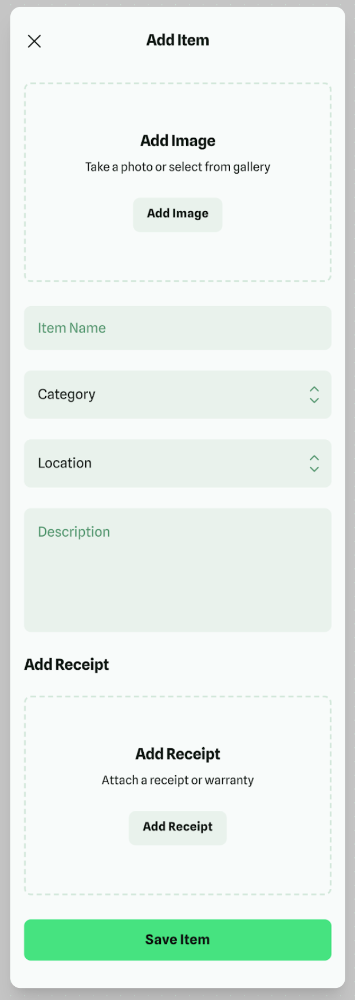
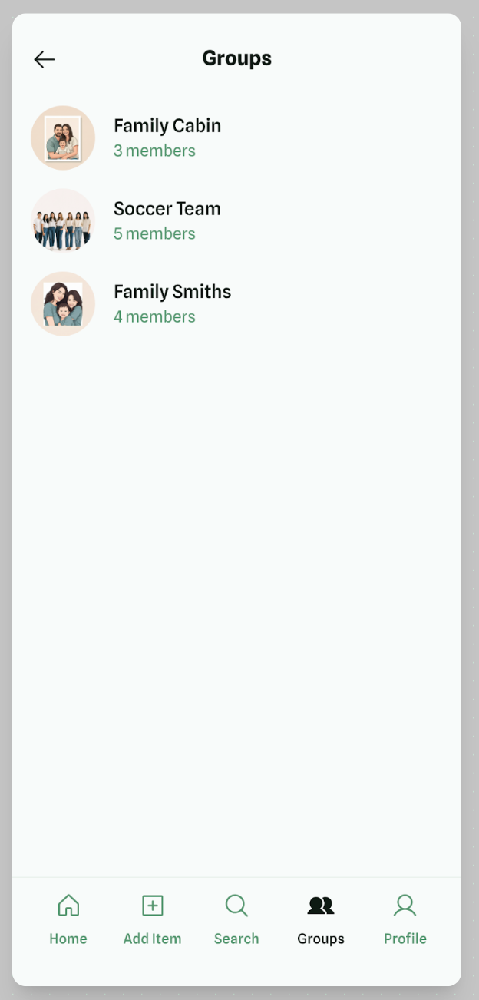
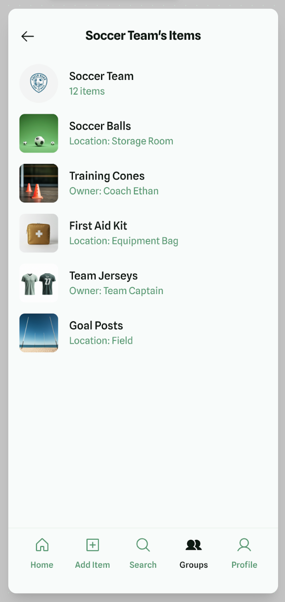

# Frontend
Repository for front end

Mockup pages (made in Google Stitch)
| First page | Add item page | Groups page |Inside of a group |
|:-----------|:------------:|------------:|------------:|
|       |        | |       |

## Colors used

Background color #F8FBFA 
Text color #52946B  
Text color Selected #0D1A12  
Fill color #EAF2EC  
Button color bright green #71DE86  

## Depencies
react-native-paper
expo-image-picker
react-navigation
@react-navigation/native (implied)
@react-navigation/bottom-tabs (implied)
react-native-screens (for react-navigation)
react-native-safe-area-context
react-native-gesture-handler
react-native-reanimated
expo/vector-icons

## Cloning project:
git clone https://github.com/Varustevahti/Frontend.git
cd Frontend

## Installing dependencies

### install expo
npx expo install

### dependencies
npx expo install react-native-paper
npx expo install expo-image-picker
npx expo install @react-navigation/native
npx expo install @react-navigation/bottom-tabs
npx expo install @react-navigation/native-stack
npx expo install @react-native-picker/picker
npx expo install react-native-safe-area-context
npx expo install react-native-screens
npx expo install @expo/vector-icons
npx expo install react-native-gesture-handler react-native-reanimated react-native-get-random-values
npx expo install expo-sqlite
npx pod-install ios
npm install @react-navigation/native-stack

## Running code: 

### Starting
npx expo start

### iOS-simulator
npx expo run:ios     # (or open with  Expo Go -app from QR-code)

### Android-emulator
npx expo run:android # (or open with  Expo Go -app from QR-code)

